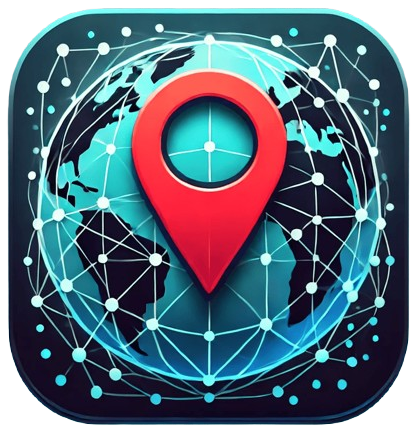

# GeoTrack

<div align="center">
  
  
  
  
  
  
</div>

---

## Descripción

**GeoTrack** es una aplicación móvil desarrollada con React Native y Expo que utiliza la API de Google Maps para mostrar y rastrear datos de ubicación en tiempo real. La aplicación incluye:
- Mapeo con polilíneas para visualizar las rutas recorridas.
- Modo de seguimiento de cámara para rastrear automáticamente tu posición.
- Reubicación automática en el mapa cuando se pierde la señal del GPS.

---

## Dependencias

El proyecto utiliza las siguientes librerías:

- **@react-navigation/native**: Librería de navegación para aplicaciones React Native.
- **expo-location**: Proporciona servicios de ubicación para obtener coordenadas GPS.
- **react-native-maps**: Componente de mapas para React Native.
- **zustand**: Librería ligera para la gestión del estado.
- **expo**: Framework para proyectos de React Native.

Revisa la lista completa en el archivo `package.json`.

---

## Permisos

Para garantizar el correcto funcionamiento de la aplicación, se requieren los siguientes permisos:

### iOS
- `NSLocationWhenInUseUsageDescription`: Esta aplicación utiliza la ubicación para rastrear tu posición.
- `NSLocationAlwaysUsageDescription`: Esta aplicación utiliza la ubicación para rastrear tu posición.
- `NSLocationAlwaysAndWhenInUseUsageDescription`: Esta aplicación utiliza la ubicación para rastrear tu posición.

### Android
- `ACCESS_COARSE_LOCATION`
- `ACCESS_FINE_LOCATION`

---

## Clonación y Ejecución del Proyecto

1. Clona el repositorio:
   ```bash
   git clone https://github.com/tu-repo/09-geotrack.git
   ```
2. Accede al directorio del proyecto:
   ```bash
    cd 09-geotrack
    ```
3. Instala las dependencias:
  ```bash
    npm install
  ```
4. Agrega tu clave de API de Google Maps:
 - Actualiza los campos expo.ios.config.googleMaps.apiKey y expo.android.config.googleMaps.apiKey en el archivo app.json o app.config.js con tus claves de API.

5. Inicia la aplicación:
   ```bash
    npx expo start -c
   ```
¡Listo para rastrear tu ubicación con GeoTrack! 🚀
